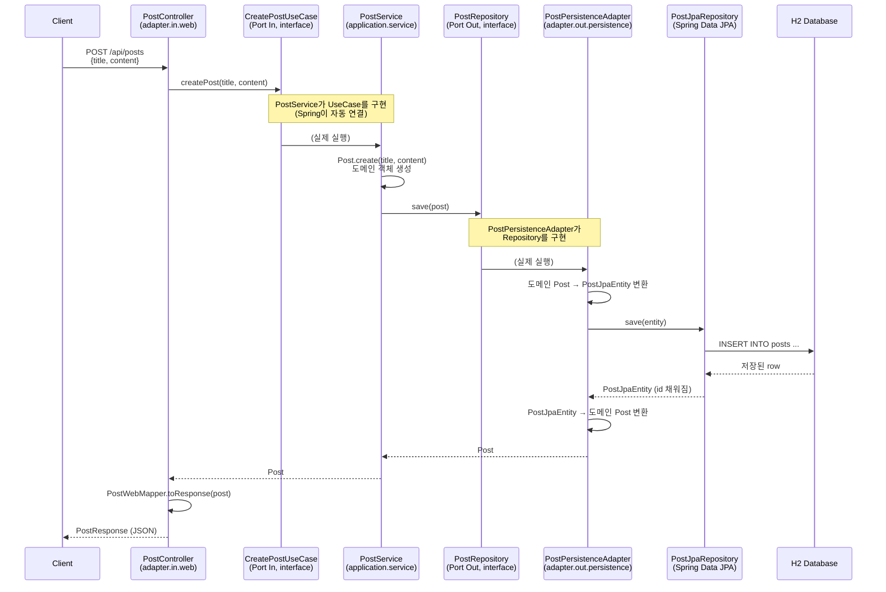
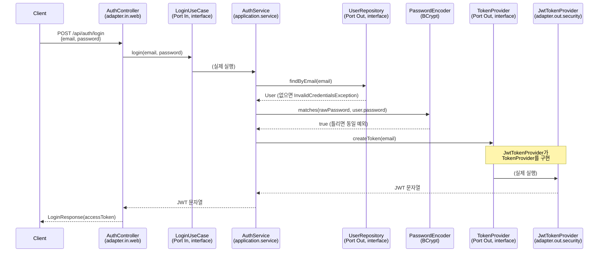
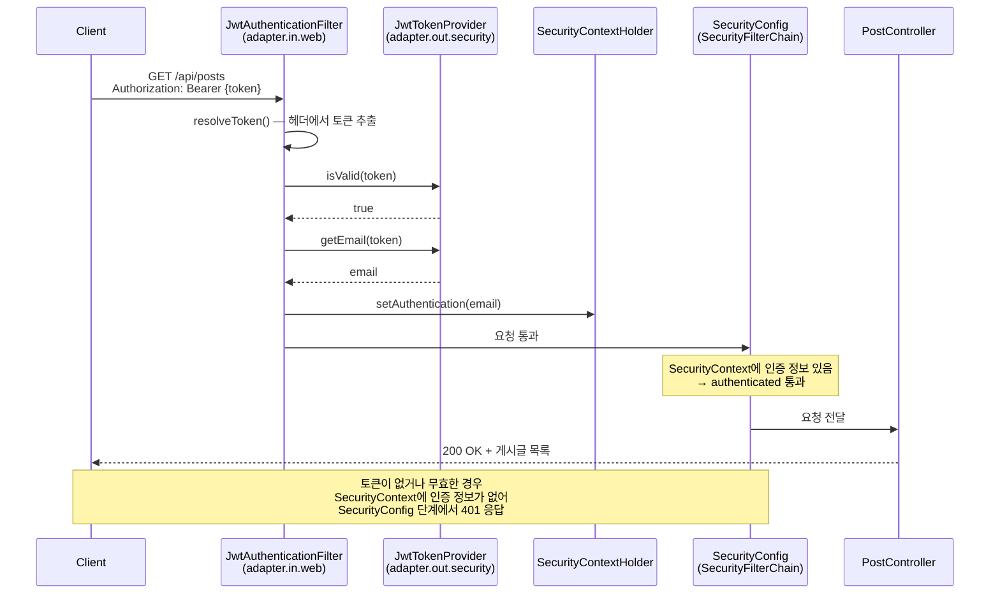

# Hexagonal Architecture 연습 프로젝트

Spring Boot로 헥사고날 아키텍처(Port & Adapter 패턴)를 직접 뜯어보고 구현하며 학습한 내용을 정리한다.

---

## 1. 헥사고날 아키텍처란?

도메인(핵심 비즈니스 로직)을 육각형 상자로 두고, 외부 세계와 연결되는 지점마다 **Port(구멍)** 를 뚫어두는 구조.
그 Port에 실제로 꽂히는 구현체가 **Adapter(플러그)** 다.

- **Port** = 인터페이스. "무엇을 할 수 있는지 / 무엇이 필요한지"의 규격만 정의하고, 구현은 없음.
- **Adapter** = Port를 실제로 구현한 클래스. 진짜 기술(JPA, REST 등)이 여기에 담김.

### Port In vs Port Out

| 구분 | Port In | Port Out |
|---|---|---|
| 방향 | 외부 → 도메인 (요청이 들어옴) | 도메인 → 외부 (요청이 나감) |
| 역할 | 도메인이 제공하는 기능 정의 (UseCase) | 도메인이 필요로 하는 기능 정의 (Repository 등) |
| 실제 구현체 위치 | `adapter.in.web` (Controller가 호출) | `adapter.out.persistence` (JPA가 구현) |

### 왜 이렇게 나누는가

- Service는 `PostRepository`라는 **인터페이스**만 알고, 그게 JPA로 구현됐는지 MongoDB로 구현됐는지 모른다.
- 나중에 저장 기술을 바꾸고 싶으면 Adapter만 새로 짜면 되고, **Service(도메인 로직)는 한 줄도 안 건드려도 된다.**
- 이게 의존성 역전(DIP) — 도메인이 프레임워크나 기술에 의존하지 않고, 오히려 기술이 도메인의 인터페이스에 맞춰 구현된다.

---

## 2. 헥사고날, 언제 쓰는 게 맞을까

헥사고날은 모든 프로젝트에 무조건 쓰는 게 아니라, **복잡도를 감당할 가치가 있을 때만** 쓰는 도구다.

### 값어치 하는 상황

| 상황 | 이유 |
|---|---|
| 인프라 교체 가능성이 실제로 있음 | DB 교체, 여러 종류의 외부 시스템(REST/gRPC/메시지큐) 교체 대응 |
| 도메인 로직이 복잡하고 오래 유지보수됨 | 비즈니스 규칙이 많고 자주 바뀌는데 기술 코드에 오염되면 테스트/수정이 힘들어짐 |
| 도메인 단위로 빠른 테스트가 필요함 | Port를 Mock으로 바꿔치기하면 DB/HTTP 없이 도메인 로직만 단위테스트 가능 |
| 여러 어댑터가 같은 도메인을 공유 | 같은 도메인을 REST API, 배치 스케줄러, 메시지 컨슈머가 함께 쓰는 경우 |

### 오버엔지니어링이 되는 상황

| 상황 | 이유 |
|---|---|
| 단순 CRUD 위주의 서비스 | 로직이 단순하면 Port/Adapter 분리 비용(파일 수 증가, 변환 코드 반복)이 이득보다 큼 |
| DB를 바꿀 일이 사실상 없음 | "유연성"이 실제로 발동될 일이 없는데 구조만 복잡해짐 |
| 작은 팀, 빠른 개발 속도가 중요 | 도메인 객체 + JPA 엔티티 이중 관리 등 보일러플레이트가 속도를 늦춤 |

### 실무와의 연결

회사 코드가 3-tier(레이어드)이고 `domain`에 `@Entity`를 직접 붙이는 방식(빈약한 도메인 모델)인 것은, 대부분의 실무 서비스에서 지극히 정상적인 선택이다. 완벽한 헥사고날을 강제하면 오히려 "이 정도로 유연할 필요가 있나?"라는 반발이 나오기 쉽고, 실무에서는 순수 헥사고날보다 "레이어드 + 부분적 인터페이스 분리" 정도로 타협하는 경우가 훨씬 흔하다.

> 이 연습 프로젝트를 만들면서 느끼는 "이거 좀 번거로운데?"라는 감각 자체가, 실무에서 헥사고날 도입 여부를 판단할 때 쓰는 감각이다.

### 실무에서 실제로 채택되는 상황/도메인

특정 도메인에 무조건 쓰인다기보다, 아래 조건 중 하나라도 강하게 걸리면 자연스럽게 채택되는 경우가 많다.

**1. 외부 연동이 많고, 연동 대상이 자주 바뀌는 도메인**

| 도메인 예시 | 이유 |
|---|---|
| 결제 시스템 | PG사(토스페이먼츠, 이니시스, 카카오페이 등)를 여러 개 붙이거나 교체하는 일이 잦음. `PaymentGateway`를 Port로 두면 PG사 교체가 Adapter 하나 추가로 끝남 |
| 알림/메시징 시스템 | SMS, 이메일, 푸시, 카카오톡 알림톡 등 채널이 계속 늘어남 |
| 물류/배송 연동 | 택배사마다 API 스펙이 다르고 자주 바뀜 |

**2. 여러 종류의 진입점이 같은 도메인을 공유하는 경우**

같은 주문 도메인을 REST API(고객용 앱), 어드민 콘솔, 배치 스케줄러(정산), 메시지 컨슈머가 동시에 사용하는 경우 — Port In이 여러 개의 진입 Adapter를 받아낼 수 있어 도메인 로직 중복 없이 재사용 가능

**3. 도메인 로직이 복잡하고 테스트가 자주 필요한 곳**

금융/보험(대출 심사, 보험료 산정), 물류 최적화(배차 알고리즘), 재고/가격 정책 엔진처럼 "조건이 많고 자주 바뀌는 비즈니스 규칙"이 핵심인 도메인. 이런 곳은 도메인 로직을 인프라와 분리해 빠르게 단위테스트로 검증하는 게 특히 중요해짐 (섹션 12에서 체감한 장점)

**4. 마이크로서비스 아키텍처와의 결합**

서비스 하나하나가 독립적으로 배포/교체되는 MSA 환경에서는, 서비스 내부를 헥사고날로 짜두면 "핵심 로직"과 "이 서비스가 쓰는 인프라(DB, 메시지 브로커)"가 명확히 분리돼 유지보수가 쉬워짐

> 정리하면: 외부 연동이 잦거나 교체 가능성이 실재하는 곳 + 여러 진입점이 도메인을 공유하는 곳 + 도메인 로직이 복잡해 테스트 격리가 중요한 곳. 이 세 조건 중 하나라도 강하게 걸리면 헥사고날이 힘을 발휘하고, 셋 다 약하면 오버엔지니어링이 되기 쉽다.

---

## 3. 패키지 구조

```
com.example.hexagonalpostapi
├── domain                          # 순수 자바 객체(POJO), 프레임워크 의존 없음
│   ├── Post
│   ├── PostCreatedEvent            # 도메인 이벤트
│   └── User
├── application
│   ├── port.in                     # 도메인이 제공하는 기능 (Port In)
│   │   ├── CreatePostUseCase
│   │   ├── GetPostUseCase
│   │   ├── GetPostListUseCase
│   │   ├── SearchPostUseCase
│   │   ├── SignUpUseCase
│   │   └── LoginUseCase
│   ├── port.out                    # 도메인이 필요로 하는 기능 (Port Out)
│   │   ├── PostRepository
│   │   ├── UserRepository
│   │   └── TokenProvider           # 토큰 발급 방식 추상화 (JWT ↔ 다른 방식 교체 대비)
│   ├── service                     # Port In의 구현체 (실제 비즈니스 로직)
│   │   ├── PostService             # 생성(Command) 담당
│   │   ├── PostQueryService        # 조회(Query) 담당 — 쓰기/읽기 책임 분리
│   │   ├── PostCreatedEventListener # 이벤트 구독, 비동기 처리
│   │   ├── UserService             # 회원가입
│   │   └── AuthService             # 로그인, 토큰 발급 위임
│   └── exception                   # 비즈니스 예외 (HTTP를 모름)
│       ├── PostNotFoundException
│       ├── DuplicateEmailException
│       └── InvalidCredentialsException
└── adapter
    ├── in.web                      # Port In의 호출자 (HTTP 진입점)
    │   ├── PostController
    │   ├── CreatePostRequest / PostResponse
    │   ├── PostWebMapper            # 도메인 ↔ 응답 DTO 변환 전담
    │   ├── AuthController           # 회원가입/로그인 엔드포인트
    │   ├── SignUpRequest / LoginRequest / LoginResponse
    │   ├── UserResponse / UserWebMapper
    │   ├── JwtAuthenticationFilter  # 요청마다 토큰 검증, 인증정보 등록
    │   ├── SecurityConfig           # 경로별 인증 필요 여부, STATELESS 설정
    │   ├── GlobalExceptionHandler    # 예외 → HTTP 상태코드 변환
    │   └── ErrorResponse
    └── out
        ├── persistence              # User는 JPA+QueryDSL, Post의 JPA 구현은 비활성(레거시 보존)
        │   ├── PostJpaEntity / PostJpaRepository        # (비활성) Post의 예전 JPA 구현, 비교용 보존
        │   ├── PostJpaCustomRepository / PostJpaCustomRepositoryImpl  # (비활성) QueryDSL
        │   ├── QueryDslConfig        # JPAQueryFactory Bean 등록 (User 등에서 재사용 가능)
        │   ├── PostPersistenceAdapter  # (비활성) @Component 제거, 코드는 비교 자료로 보존
        │   ├── UserJpaEntity / UserJpaRepository
        │   ├── UserPersistenceAdapter
        │   ├── SecurityBeanConfig    # PasswordEncoder(BCrypt) Bean 등록
        │   └── AsyncConfig           # 이벤트 리스너 비동기 처리용 스레드풀
        ├── persistence.mongo         # Post의 실제 활성 구현 (JPA에서 교체됨)
        │   ├── PostDocument          # @Document, id는 String(ObjectId)
        │   ├── PostMongoRepository   # MongoRepository, 쿼리 메서드로 제목 검색
        │   └── PostMongoPersistenceAdapter  # PostRepository(Port Out) 실제 구현체
        └── security
            └── JwtTokenProvider      # TokenProvider(Port Out) 구현 + 토큰 검증 담당
```

---

## 4. 요청 흐름: Controller → JPA 저장까지 (생성 API 예시 — 최초 JPA 구현 당시 기록)

> 이 다이어그램은 Post를 처음 JPA로 구현했을 때 그린 것. 현재 Post의 실제 저장 기술은 섹션 12에서 설명하는 MongoDB로 교체된 상태이며, 여기 나온 JPA 관련 클래스(`PostJpaEntity`, `PostPersistenceAdapter` 등)는 비활성 상태로 보존되어 있다. Controller~Service 흐름 자체는 기술 교체와 무관하게 동일하게 유지된다.



### 클래스/인터페이스 대응표

| 계층 | 이름 | 역할 |
|---|---|---|
| 도메인 | `Post` | 순수 자바 객체(POJO), 비즈니스 개념 |
| Port In | `CreatePostUseCase` | "게시글을 생성할 수 있다"는 규격 (인터페이스) |
| Port In | `GetPostUseCase` | "id로 단건 조회할 수 있다"는 규격 |
| Port In | `GetPostListUseCase` | "전체 목록을 조회할 수 있다"는 규격 |
| Port In | `SearchPostUseCase` | "제목으로 검색할 수 있다"는 규격 |
| Service | `PostService` | `CreatePostUseCase` 구현체, 생성 로직 처리 |
| Service | `PostQueryService` | `GetPostUseCase` / `GetPostListUseCase` / `SearchPostUseCase` 구현체, 조회 로직 처리 |
| Port Out | `PostRepository` | "저장/조회할 수 있어야 한다"는 규격 (인터페이스) |
| Adapter (in) | `PostController` | HTTP 요청을 받아 각 UseCase 호출 |
| Adapter (in) | `PostWebMapper` | 도메인 `Post` → `PostResponse` 변환 전담 |
| Adapter (in) | `GlobalExceptionHandler` | 비즈니스 예외를 HTTP 응답으로 변환 |
| Adapter (out) | `PostPersistenceAdapter` | `PostRepository` 구현체, 도메인 ↔ JPA 엔티티 변환 담당 |
| 기술 상세 | `PostJpaEntity` | `@Entity`가 붙은 실제 JPA 엔티티 (도메인 `Post`와 분리) |
| 기술 상세 | `PostJpaRepository` | Spring Data JPA + QueryDSL Custom 인터페이스 상속 |
| 기술 상세 | `PostJpaCustomRepositoryImpl` | QueryDSL로 짠 동적 쿼리 실제 구현 |

**핵심 포인트:** Controller는 각 UseCase 인터페이스만 알고, `PostService`/`PostQueryService`라는 구체 클래스의 존재를 모른다.
마찬가지로 Service도 `PostRepository` 인터페이스만 알고, `PostPersistenceAdapter`나 JPA/QueryDSL의 존재를 모른다.
양쪽 다 Spring이 런타임에 자동으로 연결(의존성 주입)해준다.

---

## 5. 왜 domain.Post 와 PostJpaEntity를 따로 두는가 (JPA 구현 당시 근거)

지금은 필드가 완전히 똑같아서 낭비처럼 보이지만:

- 도메인 `Post`는 **비즈니스 로직**을 담는 곳 (프레임워크 의존 없음)
- `PostJpaEntity`는 **DB 테이블과 매핑**되는 기술적인 표현

나중에 도메인 로직이 복잡해지거나(예: `Post`에 검증/계산 메서드 추가), DB 테이블 구조와 도메인 개념이 달라지기 시작하면
이 둘을 분리해둔 게 진가를 발휘한다. `PostPersistenceAdapter`가 그 변환을 전담한다.

> 현재 `PostJpaEntity`/`PostPersistenceAdapter`는 비활성 상태이며, 실제로는 `PostDocument`(MongoDB)가 같은 역할을 한다. 이 분리 원칙 자체는 기술이 바뀌어도 그대로 적용된다.

---

## 6. Mapper 패턴 (응답 변환 중복 제거)

생성/단건조회/목록조회/검색 API 모두 `Post` → `PostResponse` 변환이 필요한데, 이걸 각 메서드마다 반복하지 않고
`PostWebMapper.toResponse(post)`로 한 곳에 모았다.

- 위치: `adapter.in.web` — "도메인 객체를 HTTP 응답으로 어떻게 표현할지"는 웹 어댑터만의 관심사이기 때문.
- 도메인은 자신이 HTTP로 어떻게 보여지는지 전혀 몰라야 한다.
- 참고: `PostPersistenceAdapter` 내부의 `Post` ↔ `PostJpaEntity` 변환도 같은 성격의 관심사. 코드가 커지면 `PostPersistenceMapper`로 분리 가능 (현재는 메서드 하나뿐이라 보류).

---

## 7. QueryDSL 설정 (제목 검색 기능)

### build.gradle

```gradle
dependencies {
    // QueryDSL
    implementation 'com.querydsl:querydsl-jpa:5.1.0:jakarta'
    annotationProcessor 'com.querydsl:querydsl-apt:5.1.0:jakarta'
    annotationProcessor 'jakarta.annotation:jakarta.annotation-api'
    annotationProcessor 'jakarta.persistence:jakarta.persistence-api'
}

// Lombok 등 다른 annotationProcessor와 충돌 방지
configurations {
    compileOnly {
        extendsFrom annotationProcessor
    }
}
```

- `:jakarta` 접미사 필수 (Spring Boot 3.x+ 는 `javax` → `jakarta` 네임스페이스로 이전됨. 빠뜨리면 `NoClassDefFoundError`)
- 빌드하면 `build/generated/sources/annotationProcessor/java/main`에 `QPostJpaEntity` 같은 Q클래스가 자동 생성됨

### 구조

- `QueryDslConfig` — `JPAQueryFactory`를 Bean으로 등록
- `PostJpaCustomRepository` — QueryDSL로 구현할 커스텀 조회 메서드 규격 (인터페이스)
- `PostJpaCustomRepositoryImpl` — 실제 QueryDSL 코드 (`QPostJpaEntity`의 static 인스턴스로 타입 안전하게 조건 작성)
- `PostJpaRepository extends JpaRepository<...>, PostJpaCustomRepository` — 기본 CRUD(Spring Data JPA 자동 구현) + 커스텀 조회(QueryDSL) 를 하나의 인터페이스로 합침

### API

```
GET /api/posts/search?keyword=검색어
```

쿼리 파라미터 방식 채택. (참고: 검색 조건이 복잡해지면 `POST /api/posts/search` + body 형태도 실무에서 종종 쓰는 패턴 — 지금은 keyword 하나뿐이라 GET이 표준적)

---

## 8. 레이어별 예외처리

헥사고날 원칙상 **도메인/애플리케이션 계층은 HTTP를 몰라야 한다.** 그래서 예외 정의와 예외→HTTP 변환 책임을 분리한다.

| 계층 | 역할 |
|---|---|
| `application.exception` | 비즈니스 예외 정의 & 발생 (`PostNotFoundException`) — HTTP 상태코드 개념 없음 |
| `adapter.in.web` | `@RestControllerAdvice`로 예외를 잡아서 HTTP 상태코드로 변환 |

### 흐름

```
PostQueryService.getPost(id)
  → postRepository.findById(id) 결과가 없으면
  → PostNotFoundException 발생 (application 계층, RuntimeException 상속)
       ↓
GlobalExceptionHandler.handlePostNotFound() 가 잡아서
  → 404 Not Found + ErrorResponse(status, message) 로 변환
```

- `PostNotFoundException`은 `RuntimeException`을 상속 (Checked Exception으로 만들면 모든 Port 인터페이스 시그니처에 `throws`가 번져서 인터페이스가 오염됨)
- `GlobalExceptionHandler`는 `PostController`뿐 아니라 프로젝트의 모든 Controller에 공통 적용됨 — Controller 코드에는 try-catch가 하나도 없음

---

## 9. 이벤트 발행 & 비동기 처리

게시글이 생성되면 이벤트를 발행하고, 리스너가 이를 구독해서 처리하는 구조. 나중에 Kafka 등 외부 메시지 브로커로 확장할 것을 대비해 Spring 내장 `ApplicationEventPublisher`로 먼저 연습.

### 동기 vs 이벤트 발행

- **동기 호출**: "이거 해줘" → 결과를 기다림 → 결과를 받음 (지금까지 만든 대부분의 흐름)
- **이벤트 발행**: "이런 일이 일어났다"라고 알리기만 함 — 누가 듣는지, 언제 처리하는지 발행자는 신경 안 씀

### 구조

- `PostCreatedEvent` (`domain` 패키지) — 순수 자바 객체. "게시글이 생성됐다"는 사실만 담음, 프레임워크 의존 없음
- `PostService.createPost()` — 저장 후 `ApplicationEventPublisher.publishEvent(new PostCreatedEvent(...))` 호출
- `PostCreatedEventListener` (`application.service`) — `@EventListener`로 구독, 로그 출력

### 동기 → 비동기 전환

기본값은 동기라서, 이벤트 발행 시 리스너 처리(`handle()`)가 끝날 때까지 `createPost()`가 기다리고 트랜잭션도 같이 묶인다. 리스너 작업이 오래 걸리면 응답이 느려지는 문제가 있어 `@Async`로 비동기 전환.

```
createPost() → Post 저장 → 이벤트 발행 → 리스너를 별도 스레드에 맡기고 바로 응답 리턴
                                              (리스너 처리를 기다리지 않음)
```

- `AsyncConfig` (`adapter.out.persistence`) — `@EnableAsync` + `eventTaskExecutor`라는 이름의 커스텀 `ThreadPoolTaskExecutor` Bean 등록 (corePoolSize 2, maxPoolSize 5, queueCapacity 50)
- `PostCreatedEventListener.handle()`에 `@Async("eventTaskExecutor")` 적용
- 리스너 로그에 `Thread.currentThread().getName()`을 찍어서 별도 스레드(`event-task-*`)에서 실행되는 걸 직접 확인

**삽질 포인트 (기록):** `AsyncConfig`에 `@Configuration` 대신 `@Configurable`을 잘못 붙였더니(import 자동완성 함정 — `org.springframework.beans.factory.annotation.Configurable`), Bean 등록 자체가 안 돼서 `@Async`가 조용히 무시되고 계속 동기로 동작했음. `@Configuration`(`org.springframework.context.annotation`)으로 수정 후 정상 동작.

---

## 10. User 도메인 & JWT 인증

회원가입 → 로그인(JWT 발급) → 인증 필요한 API 보호까지의 전체 흐름.

### 비밀번호는 BCrypt로 암호화

- `SecurityBeanConfig`(`adapter.out.persistence`)에서 `PasswordEncoder` Bean으로 `BCryptPasswordEncoder` 등록
- `User.create()`는 암호화된 비밀번호만 파라미터로 받음 — **도메인은 "어떻게 암호화하는지" 모름**, 암호화는 Service(`UserService`)가 전담
- 응답 DTO(`UserResponse`)에는 비밀번호 필드를 아예 두지 않음

### 회원가입 흐름

```
AuthController.signUp()
  → SignUpUseCase.signUp() (Port In)
  → UserService: 이메일 중복 체크(existsByEmail) → 중복이면 DuplicateEmailException
  → passwordEncoder.encode()로 암호화
  → User.create() → UserRepository.save() (Port Out)
  → UserPersistenceAdapter가 UserJpaEntity로 변환해 저장
```

- `UserJpaEntity`도 `PostJpaEntity`와 같은 이유로 도메인 `User`와 분리, DB 레벨에서도 `@Column(unique = true)`로 이메일 중복 방지 (Service의 중복 체크와 별개로 동시 요청 경쟁 상황에 대한 최후 방어선)
- `UserJpaEntity`의 기본 생성자를 `protected`로 둔 이유: JPA는 리플렉션으로 객체를 생성하므로 `protected`/`private` 모두 문제없이 동작하지만, `public`으로 열어두면 외부에서 필드가 텅 빈 엔티티를 임의로 생성할 수 있어 이를 막기 위한 관례

### 로그인 & 토큰 발급 — Port Out으로 한 번 더 감싸보기 (의도적 과설계 연습)

`TokenProvider`(Port Out) 인터페이스를 만들어서, `AuthService`가 JWT라는 구체 기술을 몰라도 되게 분리했다.

```
application.port.out.TokenProvider        # createToken(email) 규격만 정의
        ↑ implements
adapter.out.security.JwtTokenProvider     # 실제 JJWT 라이브러리로 토큰 생성/검증
```

- `createToken()`만 `TokenProvider` Port Out으로 감쌈 — **토큰 발급은 Service(애플리케이션 로직)가 필요로 하는 것**이라 추상화할 가치가 있음
- `getEmail()` / `isValid()`(토큰 검증)는 인터페이스에 포함하지 않고 `JwtTokenProvider`에만 둠 — **토큰 검증은 Security Filter(순수 인프라)의 관심사**라 도메인/애플리케이션이 알 필요조차 없다고 판단
- 로그인 실패 시(`InvalidCredentialsException`) 이메일이 없는 경우와 비밀번호가 틀린 경우를 구분하지 않고 동일한 예외로 처리 — 이메일 존재 여부가 공격자에게 유추되는 것을 막기 위한 보안 관례

### secretKey / 만료시간 — 환경변수로 분리

처음엔 `secretKey`를 `JwtTokenProvider` 코드 안에 상수로 하드코딩해뒀는데, 이후 환경변수 기반으로 교체했다.

```java
public JwtTokenProvider(
        @Value("${jwt.secret}") String secret,
        @Value("${jwt.expiration}") long validityInMs) {
    this.secretKey = Keys.hmacShaKeyFor(secret.getBytes());
    this.validityInMs = validityInMs;
}
```

```yaml
# application.yml
jwt:
  secret: ${JWT_SECRET}
  expiration: ${JWT_EXPIRATION:3600000}   # 기본값 1시간(ms)
```

- `JWT_SECRET`은 기본값을 주지 않음 — 환경변수 설정을 빠뜨리고 실수로 앱을 띄우는 상황 자체를 막기 위한 의도. 환경변수 미설정 시 기동 실패.
- `JWT_EXPIRATION`은 `:3600000`으로 기본값을 둬서, 굳이 안 정해도 1시간짜리로 동작하게 함.
- 로컬 실행 시 IntelliJ Run Configuration의 Environment variables에 `JWT_SECRET` 등록 필요.
- `application.yml` 자체는 git에 커밋되므로, 여기 실제 비밀 값을 직접 적는 건 여전히 노출 위험이 있음. 지금은 연습 단계라 로컬 환경변수로만 분리했지만, 실무에서는 `.env`(gitignore 대상)나 배포 환경의 시크릿 매니저에서 값을 주입하는 게 정석.

```
AuthController.login()
  → LoginUseCase.login() (Port In)
  → AuthService: findByEmail → 없으면 InvalidCredentialsException
                → passwordEncoder.matches()로 비밀번호 검증 → 틀리면 동일 예외
                → tokenProvider.createToken() (Port Out) → JWT 문자열 반환
```

### 로그인 흐름 (토큰 발급)



### 인증이 필요한 요청 흐름 (JWT 필터)



### Spring Security 설정 요약

```
SecurityConfig (SecurityFilterChain)
    ├── /api/auth/**, /h2-console/** → permitAll (인증 없이 허용)
    └── 그 외 모든 요청 → authenticated (SecurityContext에 인증 정보 없으면 401)
```

- `SessionCreationPolicy.STATELESS` — 서버가 세션을 만들거나 유지하지 않는다는 선언. 세션 방식과 달리 서버가 로그인 상태를 기억하지 않고, 매 요청마다 클라이언트가 들고 온 토큰만으로 판단
- `csrf().disable()` — CSRF는 쿠키/세션 기반 인증에서 주로 문제되는 공격이라, 매 요청 헤더에 토큰을 직접 실어보내는 JWT 방식에선 관례적으로 비활성화
- `addFilterBefore(JwtAuthenticationFilter, ...)` — 커스텀 필터를 Spring Security 기본 필터 체인 앞에 끼워넣음

### 세션 vs JWT 핵심 차이

| | 세션 | JWT |
|---|---|---|
| 로그인 정보 저장 위치 | 서버 (메모리/DB/Redis) | 클라이언트 (토큰 자체에 정보 포함) |
| 서버가 매 요청마다 하는 일 | 세션 ID로 저장소 조회 | 토큰 서명 검증만 (저장소 조회 불필요) |
| 로그아웃/강제 만료 | 서버에서 세션 삭제 시 즉시 반영 | 토큰 자체를 무효화하기 어려움 (만료시간까지 유효) |
| 서버 확장성 | 여러 서버 간 세션 공유 필요 | Stateless라 서버를 그냥 늘리면 됨 |

---

## 11. Post 영속성 어댑터를 MongoDB로 교체 (Adapter 교체 실습)

헥사고날의 핵심 가치("저장 기술을 바꿔도 domain/application이 안 바뀐다")를 직접 검증한 실습.

### 사용 기술

- Spring Data MongoDB + `de.flapdoodle.embed.mongo.spring4x`(임베디드 MongoDB, 설치 없이 앱 실행 시 자동 기동/종료)
- `application.yml`에 `de.flapdoodle.mongodb.embedded.version` 지정 필수 (버전 미지정 시 기동 실패)

### 교체 방식

- 기존 JPA `PostPersistenceAdapter`는 `@Component`만 제거해 비활성화, 코드는 비교 자료로 보존
- `adapter.out.persistence.mongo` 패키지에 `PostDocument`(`@Document`), `PostMongoRepository`(`MongoRepository`), `PostMongoPersistenceAdapter`(`PostRepository` 구현체)를 새로 작성해 실제 활성 구현으로 교체

### 예상보다 파급이 컸던 지점 — id 타입 변경

MongoDB의 기본 식별자(`ObjectId`)는 24자리 문자열이라, JPA 시절 `Long`이었던 `domain.Post.id`를 `String`으로 바꾸는 결정을 내렸다(A안 채택). 그 결과:

- **영향 없음**: 저장 기술 교체 자체는 원래 계획대로 `adapter.out.persistence` 안에서 끝날 수 있었음
- **영향 발생**: `id` 타입 변경은 도메인 모델 자체를 바꾸는 별개의 결정이라, 이를 참조하는 모든 계층이 도미노처럼 파급됨 — `Post`, `PostCreatedEvent`, `PostNotFoundException`, `GetPostUseCase`, `PostRepository`, `PostQueryService`, `PostController`, `PostResponse`

> **배운 것:** "인프라를 바꾸는 것"과 "도메인 모델을 바꾸는 것"은 무게가 다른 변경이다. 헥사고날은 전자를 격리해주는 도구이지, 후자까지 공짜로 막아주지는 않는다.

대안(B안: `domain.Post.id`를 `Long`으로 유지하고 Adapter 내부에서 `ObjectId ↔ Long` 변환)도 검토했으나, `ObjectId`가 분산 환경용으로 설계된 값이라 숫자로 억지 변환하면 해시 충돌·정밀도 손실 등 부작용이 있어 기각. 실무에서도 A안(ID 타입을 인프라에 맞춰 설계)이 더 흔한 선택.

### 레거시 JPA 어댑터 처리

비활성화된 `PostPersistenceAdapter`도 `PostRepository` 인터페이스를 구현하는 한 시그니처를 맞춰야 해서, `id` 타입 변경의 영향을 그대로 받았다. 내부에서 `Long.valueOf()` / `String.valueOf()`로 억지 변환을 넣어 컴파일만 통과시켜 둔 상태 — 이 번거로움 자체가 위에서 기각한 B안이 실무에서 어떤 모습일지 보여주는 축소판이기도 하다.

### 트러블슈팅 기록

| 증상 | 원인 | 해결 |
|---|---|---|
| 앱 기동 실패: `Set the de.flapdoodle.mongodb.embedded.version property` | 임베디드 MongoDB 버전 미지정 | `application.yml`에 `de.flapdoodle.mongodb.embedded.version` 추가 |
| `No property 'findAllTitle' found for type 'PostDocument'` | `PostMongoRepository` 쿼리 메서드 이름 오타(`findAllTitleContaining`) | `findByTitleContaining`으로 수정 |
| 게시글 생성(POST)은 되는데 목록 조회(GET)만 403 | JWT 인증 자체는 정상 동작 중이었고, 실제 원인은 별개의 MongoDB 쿼리 에러 | 로그로 필터 통과 여부를 먼저 확인해 인증 문제가 아님을 좁혀냄 |
| `Command execution failed ... Field 'locale' is invalid in: { locale: "posts" }` | `@Document(collection = "posts")`처럼 `collection` 속성명을 명시하는 문법이 특정 라이브러리 버전 조합에서 애노테이션 파싱 오류를 일으키는 알려진 이슈 | `@Document("posts")`로 속성명 생략하고 값만 전달 |

---

## 12. 단위테스트

헥사고날 구조가 테스트에도 이점을 준다는 걸 직접 확인한 실습. Service가 Port Out 인터페이스에만 의존하므로, 실제 DB나 Spring 컨텍스트 없이 Mock으로 순식간에 검증 가능.

### 도메인 객체 테스트 (Mock 불필요)

`Post`, `User`처럼 프레임워크 의존이 없는 순수 객체는 그냥 JUnit + AssertJ로 바로 검증. `Post.create()` / `User.create()`가 `id`는 `null`로, 나머지 필드는 넘긴 값 그대로 채우는지만 확인하는 정도로도 충분.

```java
@Test
void create_시_id는_null이고_title_content는_그대로_들어간다() {
    Post post = Post.create("첫 글", "헥사고날 연습중");

    assertThat(post.getId()).isNull();
    assertThat(post.getTitle()).isEqualTo("첫 글");
    assertThat(post.getContent()).isEqualTo("헥사고날 연습중");
    assertThat(post.getCreatedAt()).isNotNull();
}
```

- Given-When-Then 패턴으로 준비/실행/검증 단계를 명확히 구분
- 테스트 메서드명을 한글 문장형으로 지어서, 이름 자체가 검증 내용을 설명하게 함

### Service 테스트 (Mockito로 Port Out을 Mock 처리)

`PostService`는 `PostRepository`, `ApplicationEventPublisher`라는 **인터페이스**만 의존하므로, 이 둘을 Mockito로 가짜 객체화하면 MongoDB/JPA/Spring 컨텍스트 없이 로직만 검증할 수 있다.

```java
@ExtendWith(MockitoExtension.class)
class PostServiceTest {

    @Mock
    private PostRepository postRepository;

    @Mock
    private ApplicationEventPublisher eventPublisher;

    @Test
    void createPost_호출시_저장하고_이벤트를_발행하며_저장된_Post를_반환한다() {
        PostService postService = new PostService(postRepository, eventPublisher);
        Post savedPost = new Post("saved-id-123", "첫 글", "헥사고날 연습중", LocalDateTime.now());
        when(postRepository.save(any(Post.class))).thenReturn(savedPost);

        Post result = postService.createPost("첫 글", "헥사고날 연습중");

        assertThat(result).isEqualTo(savedPost);
        verify(postRepository).save(any(Post.class));

        ArgumentCaptor<PostCreatedEvent> eventCaptor = ArgumentCaptor.forClass(PostCreatedEvent.class);
        verify(eventPublisher).publishEvent(eventCaptor.capture());
        assertThat(eventCaptor.getValue().getPostId()).isEqualTo("saved-id-123");
    }
}
```

- `@Mock` — 실제 구현체(JPA/MongoDB) 대신 가짜 객체 생성. `when(...).thenReturn(...)`으로 동작을 미리 정해줘야 반응함
- `verify(postRepository).save(...)` — Mock이 호출된 이력을 기록하고 있어서, 특정 메서드가 호출됐는지 사후 검증 가능
- `ArgumentCaptor` — 호출될 때 넘어간 인자 자체를 붙잡아서, 그 안의 필드 값까지 세부 검증할 수 있게 해줌

> **핵심 감각:** 이 테스트는 `PostRepository`가 실제로 MongoDB로 구현됐는지 JPA로 구현됐는지 전혀 몰라도 된다 — 오직 `PostService`의 로직(저장 요청 → 이벤트 생성 → 발행 → 반환)만 검증한다. Port/Adapter 분리 덕분에 가능한, 외부 의존성 없는 빠른 단위테스트.

### 예외 케이스 테스트 (`PostQueryService`)

Mock의 리턴값을 테스트마다 다르게 설정해서, 같은 의존성(`PostRepository`)으로 "정상 조회"와 "존재하지 않음"을 둘 다 순식간에 재현.

```java
@Test
void getPost_존재하지_않는_id로_조회하면_예외를_던진다() {
    when(postRepository.findById("no-such-id")).thenReturn(Optional.empty());

    assertThatThrownBy(() -> postQueryService.getPost("no-such-id"))
            .isInstanceOf(PostNotFoundException.class)
            .hasMessageContaining("no-such-id");
}
```

- `assertThatThrownBy(() -> ...)` — 람다로 감싸서 실행 시점을 붙잡아야 예외 발생을 검증할 수 있음 (바로 호출하면 예외가 테스트 코드 자체를 끊어버림)
- `.hasMessageContaining(...)` — 예외 메시지에 특정 값(예: 실제 id)이 포함됐는지까지 확인

### 의존성이 여러 개인 Service 테스트 (`AuthService`)

`UserRepository`, `PasswordEncoder`, `TokenProvider` 3개를 모두 Mock 처리해서 로그인 성공/이메일 없음/비밀번호 불일치 3가지 분기를 검증. `PasswordEncoder`도 Mock이라, 실제 BCrypt 연산이 뭔지 이 테스트는 전혀 몰라도 됨 — `matches(...)` 호출 시 `true`/`false`를 미리 정해두고 그 분기만 검증.

- 의존성이 몇 개로 늘어나도 패턴은 동일: `@Mock` 선언 → `when(...).thenReturn(...)` → 실행 → 검증
- 예외가 발생하는 케이스는 `verify()` 없이 `assertThatThrownBy`만으로 충분 (예외 발생 자체가 로직이 그 지점에서 멈췄다는 증거)

### Mock이 필요 없는 순수 로직 테스트 (`JwtTokenProvider`)

JWT 생성/서명/검증은 인터페이스로 감싼 게 아니라 실제 알고리즘 자체이므로, Mock 없이 `JwtTokenProvider`를 직접 생성해서 진짜 토큰으로 검증.

```java
@Test
void 다른_시크릿키로_만든_토큰은_isValid가_false다() {
    JwtTokenProvider originalProvider = new JwtTokenProvider(SECRET, 1000L * 60 * 60);
    JwtTokenProvider differentSecretProvider = new JwtTokenProvider("different-secret...", 1000L * 60 * 60);

    String token = differentSecretProvider.createToken("test@test.com");

    assertThat(originalProvider.isValid(token)).isFalse();
}

@Test
void 이미_만료된_토큰은_isValid가_false다() {
    JwtTokenProvider jwtTokenProvider = new JwtTokenProvider(SECRET, -1000L);  // 음수로 즉시 만료 재현

    String token = jwtTokenProvider.createToken("test@test.com");

    assertThat(jwtTokenProvider.isValid(token)).isFalse();
}
```

- 서로 다른 시크릿 키로 만든 두 `JwtTokenProvider` 인스턴스를 교차 검증해 위조/변조 감지를 확인
- `validityInMs`에 음수를 넣으면 `Thread.sleep()` 없이도 "즉시 만료된 토큰" 상황을 재현 가능

### IntelliJ 트러블슈팅: 테스트는 통과하는데 메서드별 결과가 안 보임

`Test Results` 트리를 펼쳐도 `PostTest` 하위의 개별 메서드명이 안 보이는 증상 — `@DisplayName`을 붙여도 해결 안 됨. **Settings → Build, Execution, Deployment → Build Tools → Gradle → "Run tests using:"** 가 `Gradle Test Runner`로 되어 있으면 가끔 트리 구조가 IntelliJ에 제대로 안 넘어오는 버그가 있음. `IntelliJ IDEA`로 바꾸면 해결.

---

## 13. 다음 학습 예정

- [x] 조회 API 추가 (`GET /api/posts/{id}`, `GET /api/posts`)
- [x] QueryDSL로 동적 쿼리 붙이기 (제목 검색)
- [x] Mapper 패턴으로 응답 변환 중복 제거
- [x] 레이어별 예외처리 (`PostNotFoundException` + `GlobalExceptionHandler`)
- [x] 이벤트 발행 구조 (`ApplicationEventPublisher`) + `@Async`로 비동기 처리
- [x] JWT 인증 붙이기 (회원가입 → 로그인 → 인증 필요 API 보호까지 전체 흐름 완성)
- [x] Post의 JPA Adapter를 MongoDB로 교체 (Port/Adapter 분리 효과 + 도메인 모델 변경의 파급 범위 체감)
- [x] JWT `secretKey` 하드코딩을 환경변수로 분리 (`@Value` + `application.yml`의 `${JWT_SECRET}` 참조, IntelliJ Run Configuration에 환경변수 등록)
- [x] 단위테스트 코드 추가하기 (도메인 순수 객체 테스트, PostService/PostQueryService/AuthService Mock 테스트, JwtTokenProvider 순수 로직 테스트)