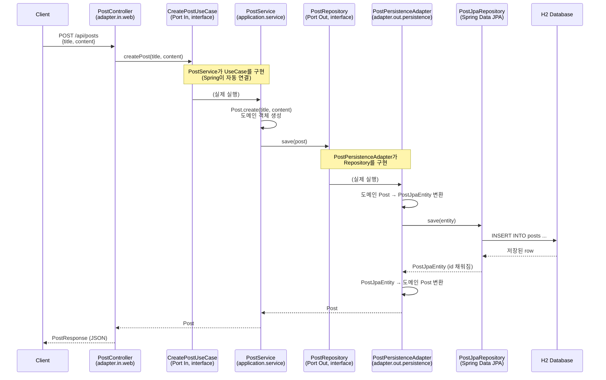

# Hexagonal Architecture 연습 프로젝트

Spring Boot로 헥사고날 아키텍처(Port & Adapter 패턴)를 직접 뜯어보고 구현하며 학습한 내용을 정리한다.

---

## 1. 헥사고날 아키텍처란?

도메인(핵심 비즈니스 로직)을 육각형 상자로 두고, 외부 세계와 연결되는 지점마다 **Port(구멍)** 를 뚫어두는 구조.
그 Port에 실제로 꽂히는 구현체가 **Adapter(플러그)** 다.

- **Port** = 인터페이스. "무엇을 할 수 있는지 / 무엇이 필요한지"의 규격만 정의하고, 구현은 없음.
- **Adapter** = Port를 실제로 구현한 클래스. 진짜 기술(JPA, REST 등)이 여기에 담김.

### Port In vs Port Out

| 구분 | Port In | Port Out |
|---|---|---|
| 방향 | 외부 → 도메인 (요청이 들어옴) | 도메인 → 외부 (요청이 나감) |
| 역할 | 도메인이 제공하는 기능 정의 (UseCase) | 도메인이 필요로 하는 기능 정의 (Repository 등) |
| 실제 구현체 위치 | `adapter.in.web` (Controller가 호출) | `adapter.out.persistence` (JPA가 구현) |

### 왜 이렇게 나누는가

- Service는 `PostRepository`라는 **인터페이스**만 알고, 그게 JPA로 구현됐는지 MongoDB로 구현됐는지 모른다.
- 나중에 저장 기술을 바꾸고 싶으면 Adapter만 새로 짜면 되고, **Service(도메인 로직)는 한 줄도 안 건드려도 된다.**
- 이게 의존성 역전(DIP) — 도메인이 프레임워크나 기술에 의존하지 않고, 오히려 기술이 도메인의 인터페이스에 맞춰 구현된다.

---

## 2. 패키지 구조

```
com.example.hexagonalpostapi
├── domain                          # 순수 자바 객체(POJO), 프레임워크 의존 없음
│   └── Post
├── application
│   ├── port.in                     # 도메인이 제공하는 기능 (Port In)
│   │   └── CreatePostUseCase
│   ├── port.out                    # 도메인이 필요로 하는 기능 (Port Out)
│   │   └── PostRepository
│   └── service                     # Port In의 구현체 (실제 비즈니스 로직)
│       └── PostService
└── adapter
    ├── in.web                      # Port In의 호출자 (HTTP 진입점)
    │   ├── PostController
    │   ├── CreatePostRequest
    │   └── PostResponse
    └── out.persistence             # Port Out의 구현체 (JPA 기술)
        ├── PostJpaEntity
        ├── PostJpaRepository
        └── PostPersistenceAdapter
```

---

## 3. 요청 흐름: Controller → JPA 저장까지



### 클래스/인터페이스 대응표

| 계층 | 이름 | 역할 |
|---|---|---|
| 도메인 | `Post` | 순수 자바 객체(POJO), 비즈니스 개념 |
| Port In | `CreatePostUseCase` | "게시글을 생성할 수 있다"는 규격 (인터페이스) |
| Service | `PostService` | `CreatePostUseCase` 구현체, 실제 비즈니스 흐름 처리 |
| Port Out | `PostRepository` | "저장할 수 있어야 한다"는 규격 (인터페이스) |
| Adapter (in) | `PostController` | HTTP 요청을 받아 `CreatePostUseCase` 호출 |
| Adapter (out) | `PostPersistenceAdapter` | `PostRepository` 구현체, 도메인 ↔ JPA 엔티티 변환 담당 |
| 기술 상세 | `PostJpaEntity` | `@Entity`가 붙은 실제 JPA 엔티티 (도메인 `Post`와 분리) |
| 기술 상세 | `PostJpaRepository` | Spring Data JPA가 자동 구현하는 저장소 인터페이스 |

**핵심 포인트:** Controller는 `CreatePostUseCase` 인터페이스만 알고, `PostService`라는 구체 클래스의 존재를 모른다.
마찬가지로 `PostService`도 `PostRepository` 인터페이스만 알고, `PostPersistenceAdapter`나 JPA의 존재를 모른다.
양쪽 다 Spring이 런타임에 자동으로 연결(의존성 주입)해준다.

---

## 4. 왜 domain.Post 와 PostJpaEntity를 따로 두는가

지금은 필드가 완전히 똑같아서 낭비처럼 보이지만:

- 도메인 `Post`는 **비즈니스 로직**을 담는 곳 (프레임워크 의존 없음)
- `PostJpaEntity`는 **DB 테이블과 매핑**되는 기술적인 표현

나중에 도메인 로직이 복잡해지거나(예: `Post`에 검증/계산 메서드 추가), DB 테이블 구조와 도메인 개념이 달라지기 시작하면
이 둘을 분리해둔 게 진가를 발휘한다. `PostPersistenceAdapter`가 그 변환을 전담한다.

---

## 5. 다음 학습 예정

- [ ] 조회 API 추가 (`GET /api/posts/{id}`)
- [ ] QueryDSL로 동적 쿼리 붙이기
- [ ] 이벤트 발행 구조 (`ApplicationEventPublisher` → 추후 Kafka 등으로 확장)
- [ ] JWT 인증 붙이기
