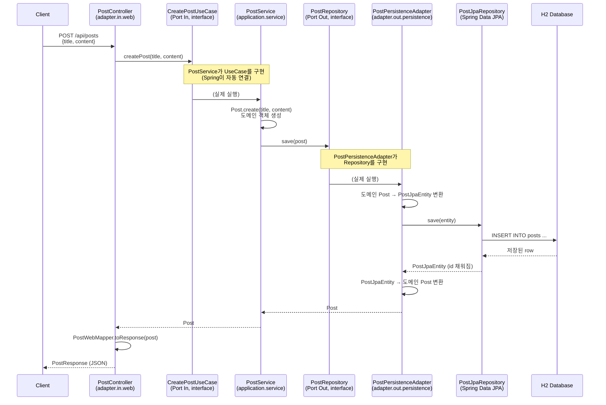

# Hexagonal Architecture 연습 프로젝트

Spring Boot로 헥사고날 아키텍처(Port & Adapter 패턴)를 직접 뜯어보고 구현하며 학습한 내용을 정리한다.

---

## 1. 헥사고날 아키텍처란?

도메인(핵심 비즈니스 로직)을 육각형 상자로 두고, 외부 세계와 연결되는 지점마다 **Port(구멍)** 를 뚫어두는 구조.
그 Port에 실제로 꽂히는 구현체가 **Adapter(플러그)** 다.

- **Port** = 인터페이스. "무엇을 할 수 있는지 / 무엇이 필요한지"의 규격만 정의하고, 구현은 없음.
- **Adapter** = Port를 실제로 구현한 클래스. 진짜 기술(JPA, REST 등)이 여기에 담김.

### Port In vs Port Out

| 구분 | Port In | Port Out |
|---|---|---|
| 방향 | 외부 → 도메인 (요청이 들어옴) | 도메인 → 외부 (요청이 나감) |
| 역할 | 도메인이 제공하는 기능 정의 (UseCase) | 도메인이 필요로 하는 기능 정의 (Repository 등) |
| 실제 구현체 위치 | `adapter.in.web` (Controller가 호출) | `adapter.out.persistence` (JPA가 구현) |

### 왜 이렇게 나누는가

- Service는 `PostRepository`라는 **인터페이스**만 알고, 그게 JPA로 구현됐는지 MongoDB로 구현됐는지 모른다.
- 나중에 저장 기술을 바꾸고 싶으면 Adapter만 새로 짜면 되고, **Service(도메인 로직)는 한 줄도 안 건드려도 된다.**
- 이게 의존성 역전(DIP) — 도메인이 프레임워크나 기술에 의존하지 않고, 오히려 기술이 도메인의 인터페이스에 맞춰 구현된다.

---

## 2. 헥사고날, 언제 쓰는 게 맞을까

헥사고날은 모든 프로젝트에 무조건 쓰는 게 아니라, **복잡도를 감당할 가치가 있을 때만** 쓰는 도구다.

### 값어치 하는 상황

| 상황 | 이유 |
|---|---|
| 인프라 교체 가능성이 실제로 있음 | DB 교체, 여러 종류의 외부 시스템(REST/gRPC/메시지큐) 교체 대응 |
| 도메인 로직이 복잡하고 오래 유지보수됨 | 비즈니스 규칙이 많고 자주 바뀌는데 기술 코드에 오염되면 테스트/수정이 힘들어짐 |
| 도메인 단위로 빠른 테스트가 필요함 | Port를 Mock으로 바꿔치기하면 DB/HTTP 없이 도메인 로직만 단위테스트 가능 |
| 여러 어댑터가 같은 도메인을 공유 | 같은 도메인을 REST API, 배치 스케줄러, 메시지 컨슈머가 함께 쓰는 경우 |

### 오버엔지니어링이 되는 상황

| 상황 | 이유 |
|---|---|
| 단순 CRUD 위주의 서비스 | 로직이 단순하면 Port/Adapter 분리 비용(파일 수 증가, 변환 코드 반복)이 이득보다 큼 |
| DB를 바꿀 일이 사실상 없음 | "유연성"이 실제로 발동될 일이 없는데 구조만 복잡해짐 |
| 작은 팀, 빠른 개발 속도가 중요 | 도메인 객체 + JPA 엔티티 이중 관리 등 보일러플레이트가 속도를 늦춤 |

### 실무와의 연결

회사 코드가 3-tier(레이어드)이고 `domain`에 `@Entity`를 직접 붙이는 방식(빈약한 도메인 모델)인 것은, 대부분의 실무 서비스에서 지극히 정상적인 선택이다. 완벽한 헥사고날을 강제하면 오히려 "이 정도로 유연할 필요가 있나?"라는 반발이 나오기 쉽고, 실무에서는 순수 헥사고날보다 "레이어드 + 부분적 인터페이스 분리" 정도로 타협하는 경우가 훨씬 흔하다.

> 이 연습 프로젝트를 만들면서 느끼는 "이거 좀 번거로운데?"라는 감각 자체가, 실무에서 헥사고날 도입 여부를 판단할 때 쓰는 감각이다.

---

## 3. 패키지 구조

```
com.example.hexagonalpostapi
├── domain                          # 순수 자바 객체(POJO), 프레임워크 의존 없음
│   └── Post
├── application
│   ├── port.in                     # 도메인이 제공하는 기능 (Port In)
│   │   ├── CreatePostUseCase
│   │   ├── GetPostUseCase
│   │   ├── GetPostListUseCase
│   │   └── SearchPostUseCase
│   ├── port.out                    # 도메인이 필요로 하는 기능 (Port Out)
│   │   └── PostRepository
│   ├── service                     # Port In의 구현체 (실제 비즈니스 로직)
│   │   ├── PostService             # 생성(Command) 담당
│   │   └── PostQueryService        # 조회(Query) 담당 — 쓰기/읽기 책임 분리
│   └── exception                   # 비즈니스 예외 (HTTP를 모름)
│       └── PostNotFoundException
└── adapter
    ├── in.web                      # Port In의 호출자 (HTTP 진입점)
    │   ├── PostController
    │   ├── CreatePostRequest
    │   ├── PostResponse
    │   ├── PostWebMapper            # 도메인 ↔ 응답 DTO 변환 전담
    │   ├── GlobalExceptionHandler    # 예외 → HTTP 상태코드 변환
    │   └── ErrorResponse
    └── out.persistence             # Port Out의 구현체 (JPA + QueryDSL 기술)
        ├── PostJpaEntity
        ├── PostJpaRepository        # Spring Data JPA + Custom(QueryDSL) 상속
        ├── PostJpaCustomRepository       # QueryDSL 커스텀 조회 인터페이스
        ├── PostJpaCustomRepositoryImpl   # QueryDSL 실제 구현
        ├── QueryDslConfig           # JPAQueryFactory Bean 등록
        └── PostPersistenceAdapter
```

---

## 4. 요청 흐름: Controller → JPA 저장까지 (생성 API 예시)



### 클래스/인터페이스 대응표

| 계층 | 이름 | 역할 |
|---|---|---|
| 도메인 | `Post` | 순수 자바 객체(POJO), 비즈니스 개념 |
| Port In | `CreatePostUseCase` | "게시글을 생성할 수 있다"는 규격 (인터페이스) |
| Port In | `GetPostUseCase` | "id로 단건 조회할 수 있다"는 규격 |
| Port In | `GetPostListUseCase` | "전체 목록을 조회할 수 있다"는 규격 |
| Port In | `SearchPostUseCase` | "제목으로 검색할 수 있다"는 규격 |
| Service | `PostService` | `CreatePostUseCase` 구현체, 생성 로직 처리 |
| Service | `PostQueryService` | `GetPostUseCase` / `GetPostListUseCase` / `SearchPostUseCase` 구현체, 조회 로직 처리 |
| Port Out | `PostRepository` | "저장/조회할 수 있어야 한다"는 규격 (인터페이스) |
| Adapter (in) | `PostController` | HTTP 요청을 받아 각 UseCase 호출 |
| Adapter (in) | `PostWebMapper` | 도메인 `Post` → `PostResponse` 변환 전담 |
| Adapter (in) | `GlobalExceptionHandler` | 비즈니스 예외를 HTTP 응답으로 변환 |
| Adapter (out) | `PostPersistenceAdapter` | `PostRepository` 구현체, 도메인 ↔ JPA 엔티티 변환 담당 |
| 기술 상세 | `PostJpaEntity` | `@Entity`가 붙은 실제 JPA 엔티티 (도메인 `Post`와 분리) |
| 기술 상세 | `PostJpaRepository` | Spring Data JPA + QueryDSL Custom 인터페이스 상속 |
| 기술 상세 | `PostJpaCustomRepositoryImpl` | QueryDSL로 짠 동적 쿼리 실제 구현 |

**핵심 포인트:** Controller는 각 UseCase 인터페이스만 알고, `PostService`/`PostQueryService`라는 구체 클래스의 존재를 모른다.
마찬가지로 Service도 `PostRepository` 인터페이스만 알고, `PostPersistenceAdapter`나 JPA/QueryDSL의 존재를 모른다.
양쪽 다 Spring이 런타임에 자동으로 연결(의존성 주입)해준다.

---

## 5. 왜 domain.Post 와 PostJpaEntity를 따로 두는가

지금은 필드가 완전히 똑같아서 낭비처럼 보이지만:

- 도메인 `Post`는 **비즈니스 로직**을 담는 곳 (프레임워크 의존 없음)
- `PostJpaEntity`는 **DB 테이블과 매핑**되는 기술적인 표현

나중에 도메인 로직이 복잡해지거나(예: `Post`에 검증/계산 메서드 추가), DB 테이블 구조와 도메인 개념이 달라지기 시작하면
이 둘을 분리해둔 게 진가를 발휘한다. `PostPersistenceAdapter`가 그 변환을 전담한다.

---

## 6. Mapper 패턴 (응답 변환 중복 제거)

생성/단건조회/목록조회/검색 API 모두 `Post` → `PostResponse` 변환이 필요한데, 이걸 각 메서드마다 반복하지 않고
`PostWebMapper.toResponse(post)`로 한 곳에 모았다.

- 위치: `adapter.in.web` — "도메인 객체를 HTTP 응답으로 어떻게 표현할지"는 웹 어댑터만의 관심사이기 때문.
- 도메인은 자신이 HTTP로 어떻게 보여지는지 전혀 몰라야 한다.
- 참고: `PostPersistenceAdapter` 내부의 `Post` ↔ `PostJpaEntity` 변환도 같은 성격의 관심사. 코드가 커지면 `PostPersistenceMapper`로 분리 가능 (현재는 메서드 하나뿐이라 보류).

---

## 7. QueryDSL 설정 (제목 검색 기능)

### build.gradle

```gradle
dependencies {
    // QueryDSL
    implementation 'com.querydsl:querydsl-jpa:5.1.0:jakarta'
    annotationProcessor 'com.querydsl:querydsl-apt:5.1.0:jakarta'
    annotationProcessor 'jakarta.annotation:jakarta.annotation-api'
    annotationProcessor 'jakarta.persistence:jakarta.persistence-api'
}

// Lombok 등 다른 annotationProcessor와 충돌 방지
configurations {
    compileOnly {
        extendsFrom annotationProcessor
    }
}
```

- `:jakarta` 접미사 필수 (Spring Boot 3.x+ 는 `javax` → `jakarta` 네임스페이스로 이전됨. 빠뜨리면 `NoClassDefFoundError`)
- 빌드하면 `build/generated/sources/annotationProcessor/java/main`에 `QPostJpaEntity` 같은 Q클래스가 자동 생성됨

### 구조

- `QueryDslConfig` — `JPAQueryFactory`를 Bean으로 등록
- `PostJpaCustomRepository` — QueryDSL로 구현할 커스텀 조회 메서드 규격 (인터페이스)
- `PostJpaCustomRepositoryImpl` — 실제 QueryDSL 코드 (`QPostJpaEntity`의 static 인스턴스로 타입 안전하게 조건 작성)
- `PostJpaRepository extends JpaRepository<...>, PostJpaCustomRepository` — 기본 CRUD(Spring Data JPA 자동 구현) + 커스텀 조회(QueryDSL) 를 하나의 인터페이스로 합침

### API

```
GET /api/posts/search?keyword=검색어
```

쿼리 파라미터 방식 채택. (참고: 검색 조건이 복잡해지면 `POST /api/posts/search` + body 형태도 실무에서 종종 쓰는 패턴 — 지금은 keyword 하나뿐이라 GET이 표준적)

---

## 8. 레이어별 예외처리

헥사고날 원칙상 **도메인/애플리케이션 계층은 HTTP를 몰라야 한다.** 그래서 예외 정의와 예외→HTTP 변환 책임을 분리한다.

| 계층 | 역할 |
|---|---|
| `application.exception` | 비즈니스 예외 정의 & 발생 (`PostNotFoundException`) — HTTP 상태코드 개념 없음 |
| `adapter.in.web` | `@RestControllerAdvice`로 예외를 잡아서 HTTP 상태코드로 변환 |

### 흐름

```
PostQueryService.getPost(id)
  → postRepository.findById(id) 결과가 없으면
  → PostNotFoundException 발생 (application 계층, RuntimeException 상속)
       ↓
GlobalExceptionHandler.handlePostNotFound() 가 잡아서
  → 404 Not Found + ErrorResponse(status, message) 로 변환
```

- `PostNotFoundException`은 `RuntimeException`을 상속 (Checked Exception으로 만들면 모든 Port 인터페이스 시그니처에 `throws`가 번져서 인터페이스가 오염됨)
- `GlobalExceptionHandler`는 `PostController`뿐 아니라 프로젝트의 모든 Controller에 공통 적용됨 — Controller 코드에는 try-catch가 하나도 없음

---

## 9. 이벤트 발행 & 비동기 처리

게시글이 생성되면 이벤트를 발행하고, 리스너가 이를 구독해서 처리하는 구조. 나중에 Kafka 등 외부 메시지 브로커로 확장할 것을 대비해 Spring 내장 `ApplicationEventPublisher`로 먼저 연습.

### 동기 vs 이벤트 발행

- **동기 호출**: "이거 해줘" → 결과를 기다림 → 결과를 받음 (지금까지 만든 대부분의 흐름)
- **이벤트 발행**: "이런 일이 일어났다"라고 알리기만 함 — 누가 듣는지, 언제 처리하는지 발행자는 신경 안 씀

### 구조

- `PostCreatedEvent` (`domain` 패키지) — 순수 자바 객체. "게시글이 생성됐다"는 사실만 담음, 프레임워크 의존 없음
- `PostService.createPost()` — 저장 후 `ApplicationEventPublisher.publishEvent(new PostCreatedEvent(...))` 호출
- `PostCreatedEventListener` (`application.service`) — `@EventListener`로 구독, 로그 출력

### 동기 → 비동기 전환

기본값은 동기라서, 이벤트 발행 시 리스너 처리(`handle()`)가 끝날 때까지 `createPost()`가 기다리고 트랜잭션도 같이 묶인다. 리스너 작업이 오래 걸리면 응답이 느려지는 문제가 있어 `@Async`로 비동기 전환.

```
createPost() → Post 저장 → 이벤트 발행 → 리스너를 별도 스레드에 맡기고 바로 응답 리턴
                                              (리스너 처리를 기다리지 않음)
```

- `AsyncConfig` (`adapter.out.persistence`) — `@EnableAsync` + `eventTaskExecutor`라는 이름의 커스텀 `ThreadPoolTaskExecutor` Bean 등록 (corePoolSize 2, maxPoolSize 5, queueCapacity 50)
- `PostCreatedEventListener.handle()`에 `@Async("eventTaskExecutor")` 적용
- 리스너 로그에 `Thread.currentThread().getName()`을 찍어서 별도 스레드(`event-task-*`)에서 실행되는 걸 직접 확인

**삽질 포인트 (기록):** `AsyncConfig`에 `@Configuration` 대신 `@Configurable`을 잘못 붙였더니(import 자동완성 함정 — `org.springframework.beans.factory.annotation.Configurable`), Bean 등록 자체가 안 돼서 `@Async`가 조용히 무시되고 계속 동기로 동작했음. `@Configuration`(`org.springframework.context.annotation`)으로 수정 후 정상 동작.

---

## 10. 다음 학습 예정

- [x] 조회 API 추가 (`GET /api/posts/{id}`, `GET /api/posts`)
- [x] QueryDSL로 동적 쿼리 붙이기 (제목 검색)
- [x] Mapper 패턴으로 응답 변환 중복 제거
- [x] 레이어별 예외처리 (`PostNotFoundException` + `GlobalExceptionHandler`)
- [x] 이벤트 발행 구조 (`ApplicationEventPublisher`) + `@Async`로 비동기 처리
- [ ] JWT 인증 붙이기 (진행 중 — Spring Security + JJWT 의존성 추가 완료)
- [ ] JPA Adapter를 다른 기술(MongoDB 등)로 교체해보기 — Port/Adapter 분리 효과 체감용, 구조가 손에 익은 뒤 마지막 단계로 진행